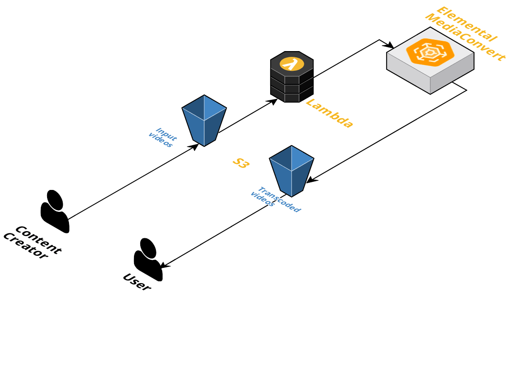

# terraform-aws-media-convert

[](https://github.com/DNXLabs/terraform-aws-media-convert/actions)
[](https://github.com/DNXLabs/terraform-aws-media-convert/blob/master/LICENSE)

AWS Elemental MediaConvert is a file-based video transcoding service that allows you to easily create video-on-demand (VOD) content for broadcast and multiscreen delivery at scale without having to worry about the complexity of building and operating your own video processing infrastructure.
This terraform module is used to set an automated workflow in order to transcode videos with your configuration.



## Prerequisites

 * You must retrieve your **AWS Elemental MediaConvert API endpoint** (account specific). For that use aws-cli and keep the given endpoint:
```sh
$ aws mediaconvert describe-endpoints

{
    "Endpoints": [
        {
            "Url": "https://abcd1234.mediaconvert.us-west-2.amazonaws.com"
        }
    ]
}
```

* You also must have an **input S3 bucket** and an **output S3 bucket** _**(those S3 buckets must be in the same AWS Region that region you'll set to terraform module)**_.

## Usage

**job.json** is a MediaConvert Job configuration example, you may want to modify **job.json** file in order to change MediaConvert Job settings. Some values are populated from Lambda function, ( *"[Populated by Lambda function]"* values ).

#### Default outputs :
**Apple HLS :**
| Resolution | Bitrate (bits/s) |
|:------------:|:---------:|
| 1280x720 | 192000 |
| 1920x1080 | 192000 |

**MP4 :**
| Resolution | Bitrate (bits/s) |
|:------------:|:---------:|
| 1920x1080 | 192000 |


Download the job configuration example and edit for your needs:
```bash
wget https://github.com/DNXLabs/terraform-aws-media-convert/blob/master/examples/job.json
```

You're now ready to use this module.

## Usage Example

```hcl
module "workflow_vod" {
  source = "git::https://github.com/DNXLabs/terraform-aws-media-convert.git"

  region                    = "ap-southeast-2"
  input_bucket_name         = "my_input_bucket_name"
  output_bucket_name        = "my_output_bucket_name"
  project_base_name         = "converter"
  bucket_event_prefix       = "input/"
  bucket_event_suffix       = ".mp4"
  mediaconvert_endpoint     = "https://abcd1234.mediaconvert.us-west-2.amazonaws.com"
  media_convert_config_name = "config"
  media_convert_config      = data.template_file.json_template.rendered
}

data "template_file" "json_template" {
  template = file("job.json")
  vars = {
    destination_s3 = "my_output_bucket_name"
  }
}
```

What does it do ?
* I upload a file _my_video_***.mp4*** to the ***input/*** folder in ***my_input_bucket_name*** bucket.
* The video file match with **bucket_event_prefix** and **bucket_event_suffix**.
* The lambda function is triggered and start MediaConvert job.
* Output video(s) are generated in the ***my_output_bucket_name*** bucket.

<!--- BEGIN_TF_DOCS --->

## Requirements

| Name | Version |
|------|---------|
| terraform | >= 0.13.0 |
| aws | >= 3.13, < 4.0 |

## Providers

| Name | Version |
|------|---------|
| archive | n/a |
| aws | >= 3.13, < 4.0 |
| local | n/a |

## Inputs

| Name | Description | Type | Default | Required |
|------|-------------|------|---------|:--------:|
| bucket\_event\_prefix | Element prefix to trigger lambda function. | `string` | `"input/"` | no |
| bucket\_event\_suffix | Element suffix to trigger lambda function. | `string` | `".mp4"` | no |
| input\_bucket\_name | Input bucket name which contains videos to be transcoded. | `string` | n/a | yes |
| media\_convert\_config | AWS Element MediaConvert API endpoint. | `string` | n/a | yes |
| media\_convert\_config\_name | AWS Element MediaConvert API endpoint. | `string` | `"config"` | no |
| mediaconvert\_endpoint | AWS Element MediaConvert API endpoint. e.g https://abcd1234.mediaconvert.us-west-2.amazonaws.com | `string` | n/a | yes |
| output\_bucket\_name | Output bucket name which contains videos after transcoding. | `string` | n/a | yes |
| project\_base\_name | Project name. | `string` | `"my_workflow_vod"` | no |
| region | AWS region | `string` | `"us-west-2"` | no |

## Outputs

| Name | Description |
|------|-------------|
| lambda\_role\_name | n/a |
| mediaconvert\_role\_name | n/a |

<!--- END_TF_DOCS --->

## Authors

Module managed by [DNX Solutions](https://github.com/DNXLabs).

## License

Apache 2 Licensed. See [LICENSE](https://github.com/DNXLabs/terraform-aws-media-convert/blob/master/LICENSE) for full details.